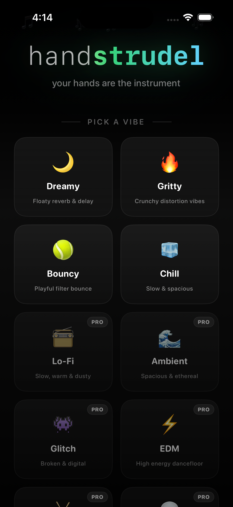
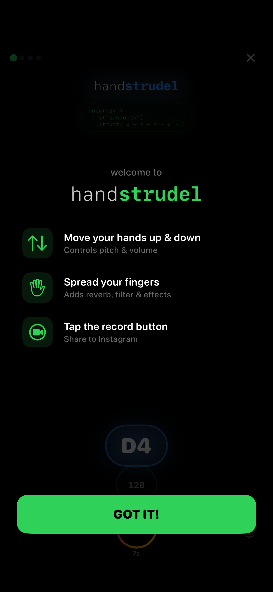
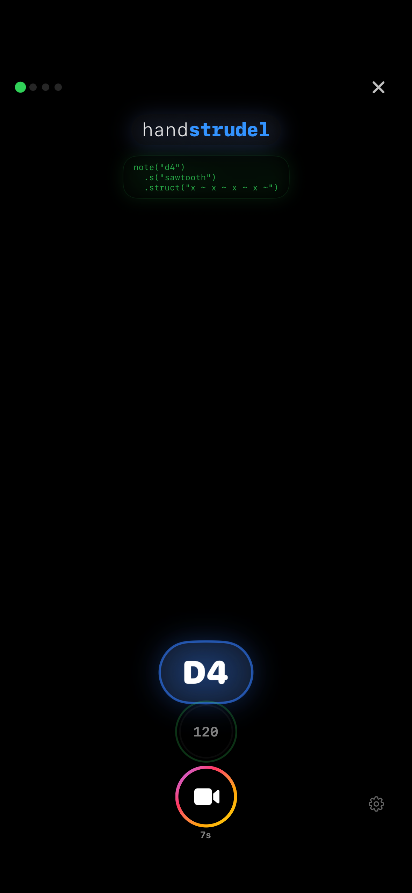

# HandStrudel

A hand-tracking musical instrument for web and iOS. Wave your hands to control a live synthesizer in real time.

**[handstrudel.com](https://handstrudel.com)** — try it now in your browser

## Screenshots

<p align="center">
  
  
  
</p>

## How It Works

HandStrudel uses your camera and hand tracking to detect both hands in real time. Hand gestures are mapped to synthesizer parameters powered by [Strudel](https://strudel.cc/).

### iOS App
- Native SwiftUI app with Apple Vision hand tracking
- Full-screen portrait camera with glowing neon hand skeleton + motion trails
- 3 modes: **Melodic** (continuous), **Grid** (pinch-to-play), **Drums** (air drumming)
- Key/scale selection with chord mode and circle of fifths
- 10 presets: Dreamy, Gritty, Bouncy, Chill + 6 premium
- 8 synth waveforms (4 free + 4 premium)
- 12 drum loops with dual tracks, volume, and speed control
- 7-second screen recording with Instagram Stories/Reels sharing
- In-app purchases for premium content
- Music theory: key, scale, chord mode, circle of fifths

### Web App
- Works in any modern browser with a webcam
- [MediaPipe Hands](https://google.github.io/mediapipe/solutions/hands) for hand tracking
- Configurable axis-to-parameter mapping
- Save gesture snapshots, stack snippets, and arrange tracks

## Tech Stack

**iOS:**
- SwiftUI + Apple Vision framework
- WKWebView running Strudel (hybrid architecture)
- Web Audio API for real-time drum/note hits
- AVCaptureSession + CADisplayLink (60fps)
- StoreKit 2 for in-app purchases
- ReplayKit for screen recording

**Web:**
- [Strudel](https://strudel.cc/) — live-coded music patterns
- [MediaPipe Hands](https://google.github.io/mediapipe/solutions/hands) — hand landmark detection
- [Next.js](https://nextjs.org/) — static export
- TypeScript

## Development

```bash
# Web
npm install
npm run dev

# iOS
cd ios/HandStrudel
xcodegen generate
open HandStrudel.xcodeproj
```

## Links

- **Web:** [handstrudel.com](https://handstrudel.com)
- **GitHub:** [github.com/khalildh/handstrudel](https://github.com/khalildh/handstrudel)
